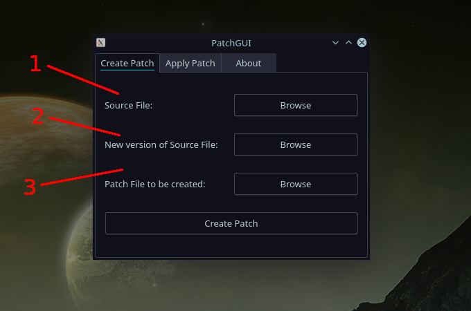
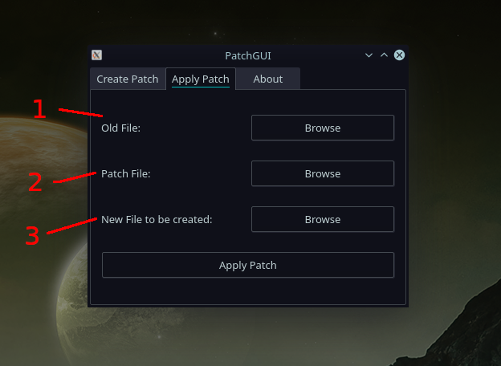

# PatchGUI
A cross-platform GUI application for creating and applying patches to binary files.

[Video Demonstration](https://www.fullstackglobal.com/patchgui-tool/)

## Releases
[Releases Page](https://github.com/Raflos10/PatchGUI/releases/)

## Creating a Patch
To create a patch for a file, the source file and new file must both be supplied.

1. The source file is the current version of a file to which the patch will be applicable. 
2. The new file is a new version of the source file with differences that the patch should apply.
3. Filename and path for the patch file to be created. 

After creating the patch file, it can be used to update any copies of the source file, applying the changes on a binary level. 

## Applying a Patch
To apply a patch on a file, the source file and patch file must both be supplied. 

1. The old file is the previous version of a file, in which the changes specified in the patch file will be applied.
2. The patch file is the file containing the changes to be applied. 
3. Filename and path for the new version of the source file to be created. 

After applying the patch file to the old file, the new file will perfectly match the one used to generate the patch file. 

## Use-case
The main use-case for this software is to generate update files that are vastly smaller and faster to download than entirely new files. These patch files can be generated and applied using this tool, or they can be generated with this tool, distributed to users, and applied using an update software that includes the bsdiff library. 
This makes downloading updates for applications much faster and take up much less space.

By using suffix sorting (specifically, Larsson and Sadakane's qsufsort) and taking advantage of how executable files change, bsdiff routinely produces binary patches 50-80% smaller than those produced by Xdelta, and 15% smaller than those produced by .RTPatch (a $2750/seat commercial patch tool).

Bsdiff runs in O((n+m) log n) time; on a 200MHz Pentium Pro, building a binary patch for a 4MB file takes about 90 seconds. bspatch runs in O(n+m) time; on the same machine, applying that patch takes about two seconds.

## Libraries Used
Bsdifflib:
https://github.com/petervas/bsdifflib (based on Binary diff/patch utility version 4.3, written by Copyright 2003-2005 Colin Percival cperciva@freebsd.org available at http://www.daemonology.net/bsdiff/)

Qt5
https://github.com/qt
